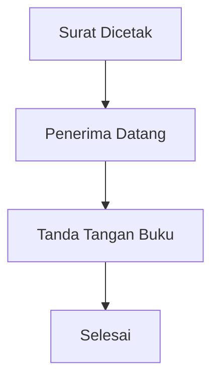
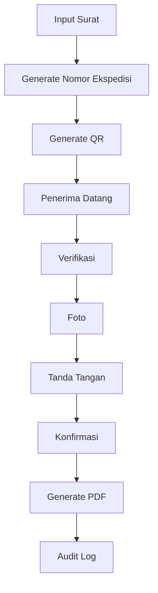
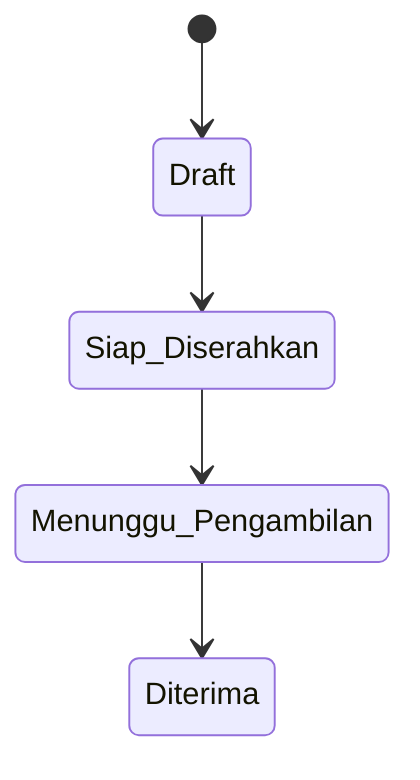

# 02 - Business Requirements & Business Process

> **Document ID:** DOC-EEKS-002  
> **Project:** e-Ekspedisi  
> **Version:** 1.0.0 (Draft)

---

# 1. Tujuan

Dokumen ini mendefinisikan kebutuhan bisnis dan proses bisnis aplikasi **e-Ekspedisi** sebagai pengganti buku ekspedisi surat keluar.

---

# 2. Gambaran Proses Bisnis

e-Ekspedisi **bukan** aplikasi pengiriman surat. Aplikasi ini digunakan untuk mencatat **serah terima dokumen** ketika penerima datang langsung ke unit persuratan.

---

# 3. Business Rules

## BR-001
Setiap surat keluar yang akan diserahkan harus memiliki Nomor Ekspedisi.

## BR-002
Setiap Nomor Ekspedisi hanya dapat digunakan untuk satu surat.

## BR-003
Penerimaan hanya dapat dilakukan satu kali.

## BR-004
Penerimaan wajib memiliki:
- Identitas penerima
- Foto penerima
- Tanda tangan digital
- Timestamp
- Bukti PDF

## BR-005
GPS bersifat konfigurabel (wajib/opsional) sesuai kebijakan instansi.

## BR-006
Semua aktivitas dicatat pada Audit Log.

---

# 4. Aktor

| Aktor | Tanggung Jawab |
|--------|----------------|
| Super Admin | Konfigurasi sistem |
| Admin Persuratan | Mengelola surat dan ekspedisi |
| Penerima | Melakukan konfirmasi penerimaan |
| Pimpinan | Monitoring dan laporan |

---

# 5. Workflow As-Is

## Permasalahan
- Buku dapat hilang
- Sulit mencari arsip
- Tidak ada audit trail
- Tidak ada bukti digital

---

# 6. Workflow To-Be

---

# 7. Status Surat

---

# 8. Use Case

- Login
- Mengelola Master Data
- Mencatat Surat Keluar
- Generate QR
- Konfirmasi Penerimaan
- Melihat Dashboard
- Mencetak Bukti Penerimaan
- Melihat Audit Log

---

# 9. SOP Singkat

## Admin Persuratan
1. Input data surat.
2. Upload PDF.
3. Generate Nomor Ekspedisi.
4. Cetak QR (opsional).
5. Saat penerima datang, buka halaman konfirmasi.
6. Pastikan data lengkap.
7. Simpan.

## Penerima
1. Memverifikasi identitas.
2. Menandatangani.
3. Foto diambil.
4. Konfirmasi.

---

# 10. Hak Akses (Ringkas)

| Fitur | Super Admin | Admin | Penerima | Pimpinan |
|-------|:-----------:|:-----:|:---------:|:---------:|
| Master Data | ✔ | ✔ | ✖ | ✖ |
| Surat Keluar | ✔ | ✔ | ✖ | ✖ |
| Konfirmasi | ✖ | ✔ | ✔ | ✖ |
| Dashboard | ✔ | ✔ | ✖ | ✔ |
| Audit Log | ✔ | ✔ | ✖ | ✔ |

---

# 11. Exception

- QR tidak ditemukan.
- Surat sudah diterima.
- Tanda tangan kosong.
- Upload foto gagal.
- PDF gagal dibuat.
- Koneksi internet terputus.

---

# 12. KPI Proses

| KPI | Target |
|------|--------|
| Waktu input surat | < 2 menit |
| Waktu konfirmasi | < 1 menit |
| Bukti PDF | Otomatis |
| Audit Trail | 100% |

---

# 13. Referensi

- 00-Project-Index.md
- 01-Project-Vision-Charter.md
- 03-PRD.md

---

# 14. Change Log

| Versi | Tanggal | Perubahan |
|--------|----------|-----------|
|1.0.0|2026-08-05|Dokumen awal|
