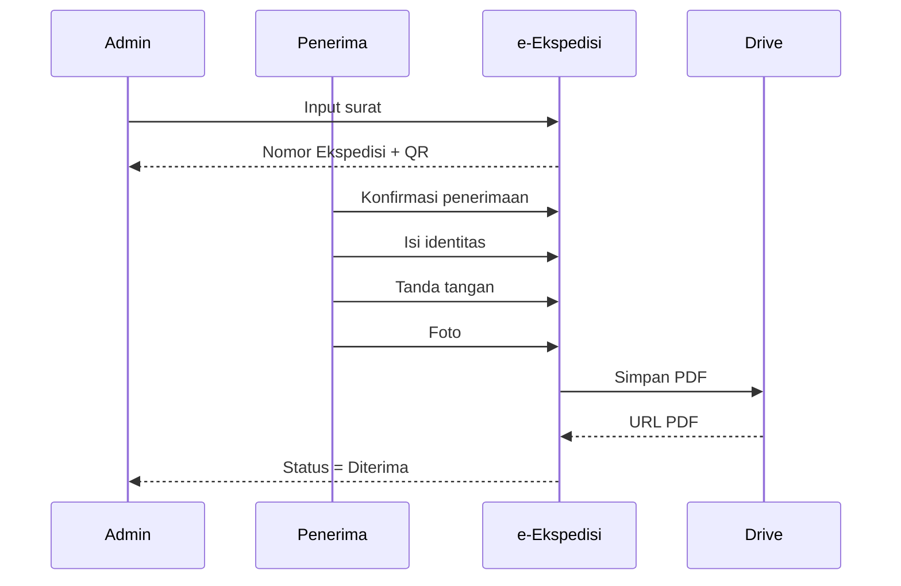
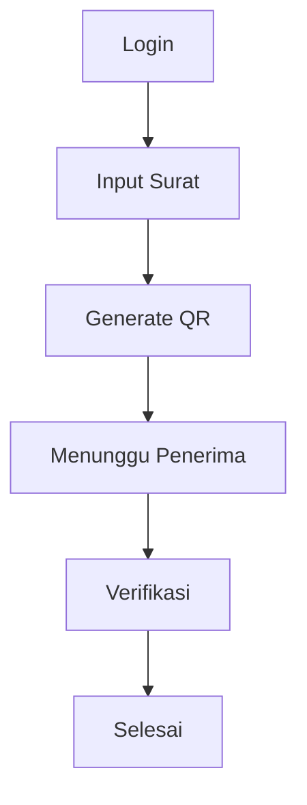

# 02A - Business Process Detail

> **Document ID:** DOC-EEKS-002A  
> **Project:** e-Ekspedisi  
> **Version:** 1.0.0 (Draft)

---

# 1. Tujuan

Dokumen ini melengkapi **02-Business-Requirements.md** dengan detail proses bisnis, diagram, glossary, dan batasan bisnis.

---

# 2. BPMN (Sederhana)


---

# 3. Sequence Diagram



---

# 4. Activity Diagram (Admin)



---

# 5. Data Flow Diagram (Level 0)

```text
Admin ----\
            \
             > e-Ekspedisi ----> Spreadsheet
            /
Penerima ---/                  \
                                 -> Google Drive
```

---

# 6. Matriks Business Rules

| Kode | Aturan | Modul |
|------|--------|-------|
| BR-001 | Nomor ekspedisi unik | Surat Keluar |
| BR-002 | Satu surat satu ekspedisi | Surat |
| BR-003 | Bukti penerimaan hanya sekali | Penerimaan |
| BR-004 | Audit log wajib | Semua |
| BR-005 | PDF dibuat otomatis | Penerimaan |
| BR-006 | QR memiliki token | QR |

---

# 7. Glossary

| Istilah | Definisi |
|---------|----------|
| Ekspedisi | Bukti serah terima dokumen |
| Nomor Ekspedisi | Nomor unik transaksi |
| Bukti Penerimaan | PDF hasil konfirmasi |
| Audit Trail | Riwayat aktivitas pengguna |

---

# 8. Matriks Kebutuhan Stakeholder

| Stakeholder | Kebutuhan |
|-------------|-----------|
| Pimpinan | Dashboard & laporan |
| Admin | Input cepat |
| Penerima | Konfirmasi sederhana |
| Auditor | Audit trail lengkap |

---

# 9. Business Constraints

- Menggunakan Google Apps Script.
- Database menggunakan Google Spreadsheet.
- Penyimpanan file menggunakan Google Drive.
- Tidak memerlukan server/VPS.
- Mendukung browser modern.
- Seluruh bukti penerimaan harus tersimpan permanen.

---

# 10. Traceability (Awal)

| Business Rule | Fitur PRD |
|--------------|-----------|
| BR-001 | Generate Nomor Ekspedisi |
| BR-002 | Validasi Surat |
| BR-003 | Konfirmasi Penerimaan |
| BR-004 | Audit Trail |
| BR-005 | Generate PDF |

---

# 11. Referensi

- 00-Project-Index.md
- 01-Project-Vision-Charter.md
- 02-Business-Requirements.md
- 03-PRD.md

---

# 12. Change Log

| Versi | Tanggal | Perubahan |
|-------|----------|-----------|
|1.0.0|2026-08-05|Dokumen detail proses bisnis|
