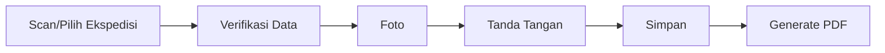

# 03A - Functional Specification Detail

> **Document ID:** DOC-EEKS-003A  
> **Project:** e-Ekspedisi  
> **Version:** 1.0.0 (Draft)

---

# Tujuan

Dokumen ini melengkapi PRD dengan spesifikasi fungsional rinci untuk setiap modul sehingga dapat langsung dijadikan acuan implementasi.

---

# Modul 1 - Dashboard

## Tujuan
Memberikan ringkasan kondisi surat keluar.

## Widget
- Surat Menunggu Pengambilan
- Surat Diterima Hari Ini
- Surat Diterima Bulan Ini
- Grafik Bulanan
- Aktivitas Terakhir

## Acceptance Criteria
- Data dimuat < 2 detik.
- Filter berdasarkan tanggal tersedia.

---

# Modul 2 - Surat Keluar

## Form Input

| Field | Wajib | Validasi |
|--------|:----:|----------|
| Nomor Surat | ✔ | Unik |
| Tanggal | ✔ | Tidak boleh kosong |
| Perihal | ✔ | Maks. 255 karakter |
| Tujuan | ✔ | Pilih master |
| PDF Surat | ✔ | PDF, ukuran sesuai konfigurasi |

## Aksi
- Simpan
- Simpan & Generate QR
- Batal

---

# Modul 3 - Konfirmasi Penerimaan

## Alur

## Validasi
- Tanda tangan wajib.
- Foto wajib.
- Jika GPS diwajibkan oleh konfigurasi, koordinat harus tersedia.

---

# Modul 4 - Bukti Penerimaan

PDF memuat:
- Nomor Ekspedisi
- Nomor Surat
- Identitas Penerima
- Foto
- Tanda Tangan
- Timestamp
- QR Verifikasi

---

# Modul 5 - Audit Trail

Dicatat:
- Login
- Tambah surat
- Ubah data
- Konfirmasi penerimaan
- Generate PDF

---

# Error Handling

| Kode | Pesan |
|------|-------|
| E001 | Nomor surat sudah digunakan |
| E002 | QR tidak valid |
| E003 | Surat sudah diterima |
| E004 | Upload PDF gagal |
| E005 | Generate PDF gagal |

---

# Referensi

- 03-PRD.md
- 02B-Business-Rules-Catalog.md

---

# Change Log

| Versi | Tanggal | Perubahan |
|--------|----------|-----------|
|1.0.0|2026-08-05|Draft awal|
