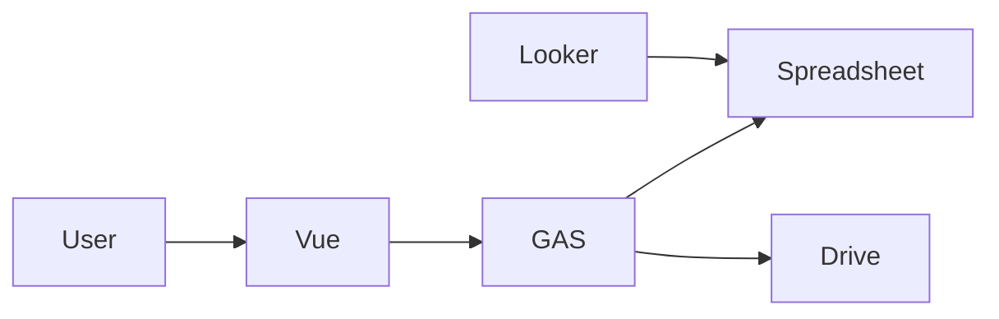
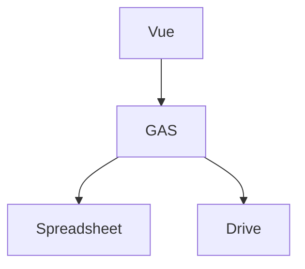
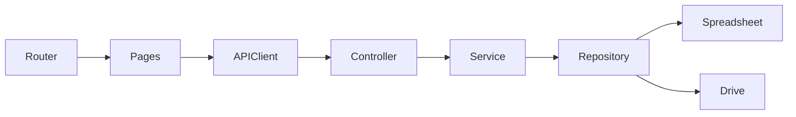
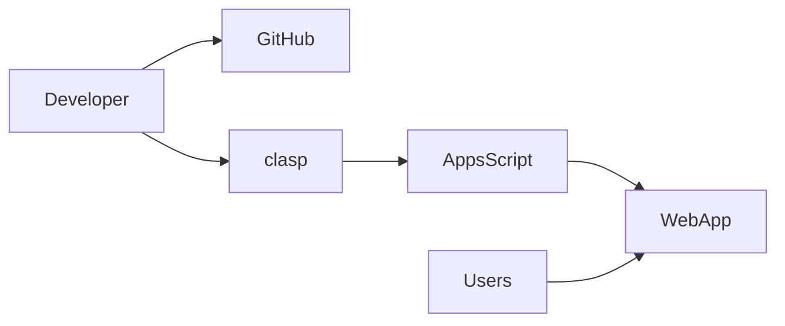

# 04 - System Architecture

> **Document ID:** DOC-EEKS-004  
> **Project:** e-Ekspedisi  
> **Version:** 1.0.0 (Draft)

---

# 1. Tujuan

Dokumen ini menjelaskan arsitektur teknis e-Ekspedisi sebagai acuan implementasi.

# 2. Prinsip Arsitektur

- Modular
- API First
- Mobile First
- Security by Design
- Google Workspace Native

# 3. Technology Stack

| Komponen | Teknologi |
|---|---|
| Frontend | Vue 3 + Vite + Pinia + PrimeVue |
| Backend | Google Apps Script |
| Database | Google Spreadsheet |
| File Storage | Google Drive |
| Dashboard | Looker Studio |
| Deployment | Apps Script Web App |

# 4. C4 Context

# 5. Container Diagram

# 6. Component Diagram

# 7. Deployment

# 8. ADR

- ADR-001: Menggunakan GAS agar bebas biaya server.
- ADR-002: Spreadsheet sebagai database.
- ADR-003: Google Drive sebagai penyimpanan.
- ADR-004: Vue 3 sebagai frontend terpisah.

# 9. Non Functional

- HTTPS
- Audit Trail
- RBAC
- Backup Spreadsheet
- Monitoring kuota Apps Script

# 10. Referensi

- 03-PRD.md
- 05-Database-Data-Dictionary.md
