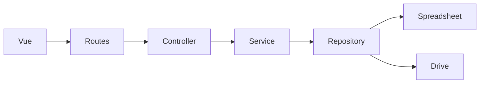

# 04A - Google Apps Script Architecture

> **Document ID:** DOC-EEKS-004A
> **Project:** e-Ekspedisi
> **Version:** 1.0.0 (Draft)

## Tujuan
Menjelaskan arsitektur backend Google Apps Script.

## Struktur Proyek

```text
backend-gas/
├── appsscript.json
├── Code.gs
├── Routes.gs
├── Config.gs
├── controllers/
├── services/
├── repositories/
├── models/
├── middleware/
├── utils/
└── tests/
```

## Request Flow



## Repository Pattern
- Semua akses Spreadsheet melalui Repository.
- Semua akses Drive melalui Repository.

## Service Layer
- Business Rules
- Validasi
- Audit Trail
- Generate PDF

## Spreadsheet
- surat_keluar
- penerimaan
- pegawai
- audit_log
- master_unit
- konfigurasi

## Drive
- Surat/
- Bukti-Penerimaan/
- Foto/
- Signature/
- QR/

## Cache
Gunakan CacheService untuk master data dan konfigurasi.

## Quota
- Batch read/write
- Hindari scan seluruh sheet
- Gunakan cache

## Error Handling

|Kode|Makna|
|---|---|
|400|Validasi gagal|
|401|Unauthorized|
|404|Data tidak ditemukan|
|500|Internal error|

## Referensi
- 04-System-Architecture.md
- 05-Database-Data-Dictionary.md
