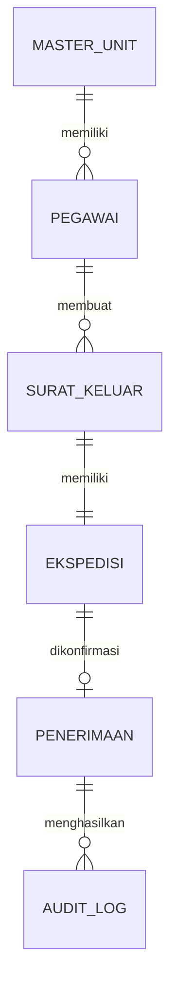

# 05 - Database & Data Dictionary

> **Document ID:** DOC-EEKS-005  
> **Project:** e-Ekspedisi  
> **Version:** 1.0.0 (Draft)

---

# 1. Tujuan

Dokumen ini mendefinisikan desain data aplikasi e-Ekspedisi, termasuk struktur Google Spreadsheet, relasi entitas, data dictionary, serta standar pengelolaan data.

---

# 2. Prinsip Desain

- Satu sheet = satu entitas.
- Primary Key menggunakan UUID.
- Soft delete untuk data master.
- Audit Trail tidak boleh diubah.
- Tidak menyimpan data yang redundan.

---

# 3. Model Data (ERD)



---

# 4. Struktur Spreadsheet

| Sheet | Fungsi |
|--------|--------|
| surat_keluar | Data surat |
| ekspedisi | Data ekspedisi |
| penerimaan | Bukti penerimaan |
| pegawai | Data admin |
| master_unit | Referensi unit |
| konfigurasi | Konfigurasi aplikasi |
| audit_log | Riwayat aktivitas |

---

# 5. Data Dictionary

## Sheet: surat_keluar

| Kolom | Tipe | Wajib | Keterangan |
|--------|------|:----:|------------|
| id | UUID | ✔ | Primary Key |
| nomor_surat | String | ✔ | Nomor surat unik |
| tanggal_surat | Date | ✔ | Tanggal surat |
| perihal | String | ✔ | Perihal surat |
| unit_id | UUID | ✔ | Relasi master_unit |
| file_pdf | String | ✔ | ID/URL Drive |
| status | Enum | ✔ | Draft, Menunggu Pengambilan, Diterima |
| created_at | DateTime | ✔ | Waktu dibuat |
| updated_at | DateTime | ✔ | Waktu perubahan |

## Sheet: ekspedisi

| Kolom | Tipe | Wajib | Keterangan |
|--------|------|:----:|------------|
| id | UUID | ✔ | Primary Key |
| nomor_ekspedisi | String | ✔ | Nomor unik |
| surat_id | UUID | ✔ | FK surat_keluar |
| qr_token | String | ✔ | Token QR |
| qr_url | String | ✔ | URL verifikasi |

## Sheet: penerimaan

| Kolom | Tipe | Wajib | Keterangan |
|--------|------|:----:|------------|
| id | UUID | ✔ | Primary Key |
| ekspedisi_id | UUID | ✔ | FK ekspedisi |
| nama_penerima | String | ✔ | Nama penerima |
| jabatan | String | ✔ | Jabatan |
| instansi | String | ✔ | Instansi |
| foto_url | String | ✔ | Google Drive |
| signature_url | String | ✔ | Google Drive |
| gps_lat | Number | ○ | Latitude |
| gps_lng | Number | ○ | Longitude |
| pdf_bukti | String | ✔ | Bukti PDF |
| diterima_pada | DateTime | ✔ | Timestamp |

## Sheet: audit_log

| Kolom | Tipe | Keterangan |
|--------|------|------------|
| id | UUID | PK |
| user | String | Pengguna |
| aksi | String | Aktivitas |
| objek | String | Entitas |
| hasil | String | Success/Fail |
| waktu | DateTime | Timestamp |

---

# 6. Standar Penamaan

- Primary Key: `id`
- Foreign Key: `<entity>_id`
- Timestamp: `created_at`, `updated_at`
- URL Drive: `<nama>_url`

---

# 7. Struktur Google Drive

```text
e-Ekspedisi/
├── Surat/
├── Bukti-Penerimaan/
├── Foto/
├── Signature/
└── QR/
```

---

# 8. Validasi Data

- UUID wajib unik.
- Nomor surat unik.
- Nomor ekspedisi unik.
- File PDF hanya format PDF.
- Foto hanya JPG/PNG.

---

# 9. Retensi Data

| Data | Retensi |
|------|---------|
| Surat | Permanen |
| Bukti PDF | Permanen |
| Audit Log | Permanen |
| Konfigurasi | Selama aplikasi aktif |

---

# 10. Mapping

| Entitas | Modul |
|----------|-------|
| surat_keluar | Surat Keluar |
| ekspedisi | Ekspedisi |
| penerimaan | Konfirmasi |
| audit_log | Audit |

---

# 11. Referensi

- 04-System-Architecture.md
- 06-API-Specification.md
- 03-PRD.md

---

# 12. Change Log

| Versi | Tanggal | Perubahan |
|--------|----------|-----------|
|1.0.0|2026-08-05|Draft awal|
