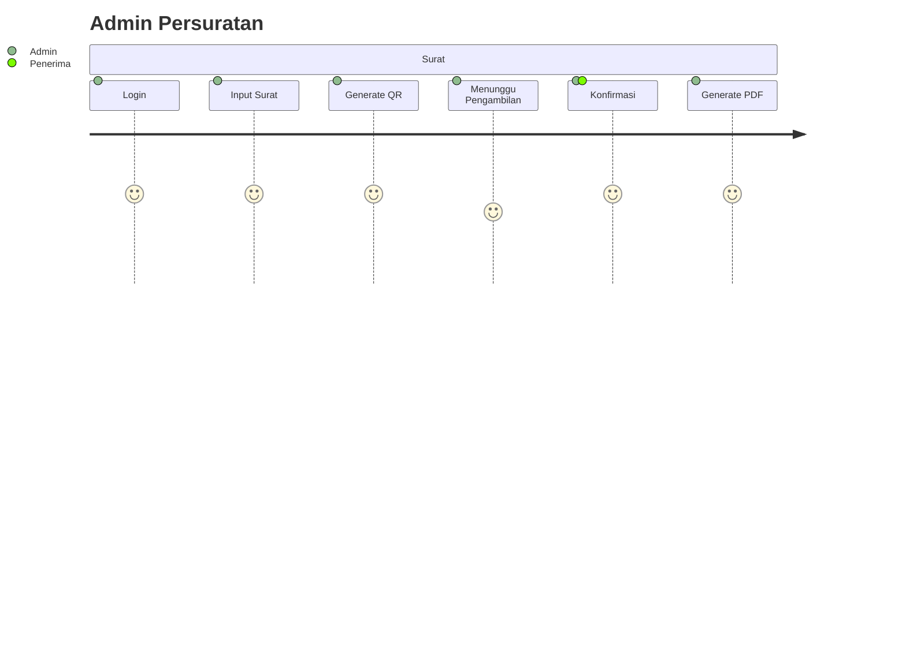

# 07 - UI/UX & User Journey

> **Document ID:** DOC-EEKS-007  
> **Project:** e-Ekspedisi  
> **Version:** 1.0.0 (Draft)

---

# 1. Tujuan

Dokumen ini mendefinisikan pengalaman pengguna (UX), struktur antarmuka (UI), navigasi, serta perjalanan pengguna (User Journey) aplikasi **e-Ekspedisi**.

---

# 2. Prinsip Desain

- Mobile First
- Simple & Fast
- Konsisten
- Mudah dipelajari
- Aksesibilitas
- Minimal klik

---

# 3. Persona

## Admin Persuratan
- Menginput surat.
- Melakukan konfirmasi penerimaan.
- Mencetak bukti.

## Pimpinan
- Memantau dashboard.
- Melihat laporan.

## Super Admin
- Mengelola konfigurasi.

## Penerima
- Mengonfirmasi penerimaan.

---

# 4. Sitemap

```text
Login
│
├── Dashboard
├── Surat Keluar
│   ├── Daftar
│   ├── Tambah
│   └── Detail
├── Ekspedisi
├── Konfirmasi Penerimaan
├── Laporan
├── Audit Trail
└── Pengaturan
```

---

# 5. User Journey



---

# 6. Navigasi

- Sidebar (Desktop)
- Bottom Navigation (Mobile)
- Breadcrumb
- Quick Search
- Global Notification

---

# 7. Daftar Halaman

| Halaman | Hak Akses |
|---------|-----------|
| Login | Semua |
| Dashboard | Admin, Pimpinan |
| Surat Keluar | Admin |
| Detail Surat | Admin |
| Konfirmasi | Admin, Penerima |
| Audit Trail | Admin, Super Admin |
| Pengaturan | Super Admin |

---

# 8. Komponen UI

- Data Table
- Search Box
- Filter
- QR Viewer
- Signature Pad
- Camera Capture
- Upload PDF
- Toast Notification
- Modal Dialog

---

# 9. Responsive

| Device | Lebar |
|---------|------:|
| Mobile | <768 px |
| Tablet | 768–1024 px |
| Desktop | >1024 px |

---

# 10. Loading & Empty State

## Loading
- Skeleton Loader
- Progress Bar

## Empty State
- "Belum ada data."

## Error State
- "Terjadi kesalahan. Silakan coba kembali."

---

# 11. Mapping

| Halaman | API |
|----------|-----|
| Login | /auth |
| Dashboard | /dashboard |
| Surat | /surat |
| Konfirmasi | /penerimaan |

---

# 12. Referensi

- 03-PRD.md
- 06-API-Specification.md
- 08-Security-Compliance.md

---

# 13. Change Log

| Versi | Tanggal | Perubahan |
|--------|----------|-----------|
|1.0.0|2026-08-05|Draft awal|
